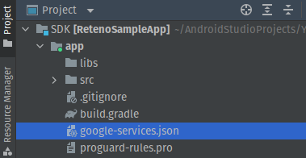

# Android

The Reteno Android SDK for Mobile Customer Engagement and Analytics solutions.

---

## Overview

`Reteno` is a lightweight SDK for Android that helps mobile teams integrate Reteno into their mobile apps. The server-side library makes it easy to call the `Reteno API`

##### The SDK supports

- Native Android applications written in **Java**/**Kotlin** 

- Android 8.0 or later (minSdk = 26)

### Getting started with Reteno SDK for Android

1. Add mavenCentral repository in your project level `build.gradle`:

```groovy
buildscript { 
    repositories { 
    mavenCentral() 
    } 
... 
}
```

2. Add `reteno` and `firebase` dependencies in application level `build.gradle`:

```groovy
dependencies {
    implementation 'core.reteno:fcm:(latest_version_here)'
    ...
    implementation "com.google.firebase:firebase-messaging:23.1.0"
    implementation "com.google.firebase:firebase-messaging-ktx:23.1.0"
}
```

| **Library**                     | **Description**                                                       |
| ------------------------------- | --------------------------------------------------------------------- |
| core.reteno:fcm                 | FCM enables push notifications through SDK and all core functionality |
| firebase:firebase-messaging     | Firebase cloud messaging                                              |
| firebase:firebase-messaging-ktx | Firebase cloud messaging Kotlin extensions                            |

###### License​ :

`Reteno Android SDK` is released under the MIT license. See [LICENSE](https://github.com/reteno-com/reteno-mobile-android-sdk/blob/main/LICENSE) for details.

## 

## Setting up SDK

Follow our setup guide to integrate the Reteno SDK with your app.

1. Add reteno.access-key into your local.properties file in root directory of the project:

`reteno.access-key = "********-****-***-****-************"`

2. Make sure to enable androidx in your gradle.properties file

```groovy
android.useAndroidX=true
android.enableJetifier=true
```

3. Make sure to add `core.reteno:fcm` and firebase dependencies in build.gradle

> Note:
> 
> Java 1.8 compiler is required. In app level `build.gradle`:

```groovy
android {
    compileOptions {
        sourceCompatibility JavaVersion.VERSION_1_8
        targetCompatibility JavaVersion.VERSION_1_8
    }
}
```

4. Edit your custom Application class.
   Below is sample code you can add to your application class which gets you started with `RetenoSDK`. You may need to create a new class that extends the `Application` on this step. Don't forget to edit your manifest file to use the custom Application class:

```java
package [com.YOUR_PACKAGE];

import android.app.Application;

import androidx.annotation.NonNull;

import com.reteno.core.Reteno;
import com.reteno.core.RetenoApplication;
import com.reteno.core.RetenoImpl;

public class CustomApplication extends Application implements RetenoApplication {

    private Reteno retenoInstance;

    @Override
    public void onCreate() {
        super.onCreate();
        retenoInstance = new RetenoImpl(this);
    }

    @NonNull
    @Override
    public Reteno getRetenoInstance() {
        return retenoInstance;
    }
}
```

```kotlin
package [com.YOUR_PACKAGE];

import android.app.Application
import com.reteno.core.Reteno
import com.reteno.core.RetenoApplication
import com.reteno.core.RetenoImpl

class CustomApplication: Application(), RetenoApplication {

    private lateinit var retenoInstance: Reteno

    override fun onCreate() {
        super.onCreate()
        retenoInstance = RetenoImpl(this)
    }

    override fun getRetenoInstance(): Reteno {
        return retenoInstance
    }
}
```

**Manifest.xml**

```xml
<application
        android:name=".CustomApplication"
        ...
        >
...
</application>
```

5. Make sure to use SDK via `Reteno` interface, not `RetenoImpl` implementation. You may now access Reteno SDK across your application via your app instance. E.g. in Activity:

```java
Reteno reteno = ((CustomApplication)getApplication()).getRetenoInstance();
```

```kotlin
val reteno = (application as CustomApplication).getRetenoInstance()
```

> **Optional.** RetenoSDK utilizes Sentry for its internal purposes. If you are using Sentry in your application make sure to add `tools:node="replace"` in your AndroidManifest.xml for the SentryDSN meta data section.

```xml
<meta-data
            android:name="io.sentry.dsn"
            android:value="https://DSN_HERE"
            tools:node="replace" />
```

> **Optional.** You may add your default icon for all Reteno notifications via AndroidManifest.xml

```xml
<meta-data
            android:name="@string/notification_icon"
            android:resource="@drawable/ic_notification" />
```

> **Note:** If your app is running on Android 13 or later make sure to handle [Notification runtime permissions](https://developer.android.com/develop/ui/views/notifications/notification-permission)

6. Final step: make sure to set up your Firebase application for Firebase Cloud Messaging:
   
   - Verify that your Gradle files include the correct FCM and [Reteno libraries](https://docs.reteno.com/reference/android-sdk-setup#getting-started-with-reteno-sdk-for-android) 
   
   - Download your `google-services.json` config file (see how [here](https://support.google.com/firebase/answer/7015592?hl=en)).
   
   - Add the above file to your root `app/` folder.
   
       
   
   - Copy your FCM Server Key. In the [Firebase console](https://console.firebase.google.com/), click the gear icon next to Overview, then click Project Settings->Cloud Messaging -> Manage Service Accounts. Go to Service accounts to download FirebaseAdminSdk account's json key.
   
   
   
   
   
- Follow this manual to [set up Reteno admin panel](https://docs.reteno.com/docs/connect-your-mobile-app) with your Firebase key.

##### Now you are ready to run your app and send a marketing push notification to your application.
