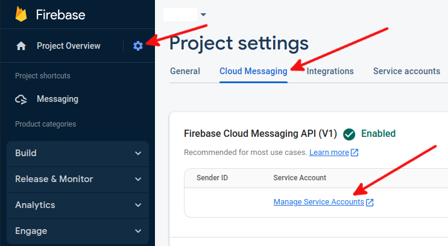
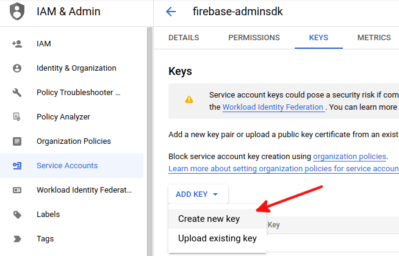

# Android

[GitHub repo](https://github.com/reteno-com/reteno-mobile-android-sdk)
[Documentation](https://docs.reteno.com/reference/android-sdk-setup)

The Reteno Android SDK for Mobile Customer Engagement and Analytics solutions.

---

## Overview

`Reteno` is a lightweight SDK for Android that helps mobile teams integrate Reteno into their mobile apps. The server-side library makes it easy to call the `Reteno API`

##### The SDK supports

- Native Android applications written in **Java**/**Kotlin**

- Android 8.0 or later (minSdk = 26)

### Getting started with Reteno SDK for Android

1. Add mavenCentral repository in your project level `build.gradle`:

```groovy
buildscript {
  repositories {
    mavenCentral()
  }
  ...
}
```

2. Add `reteno` and `firebase` dependencies in application level `build.gradle`:

```groovy
dependencies {
  implementation 'com.reteno:fcm:(latest_version_here)'
  ...
  implementation "com.google.firebase:firebase-messaging:23.1.0"
  implementation "com.google.firebase:firebase-messaging-ktx:23.1.0"
}
```

| **Library**                     | **Description**                                                       |
| ------------------------------- | --------------------------------------------------------------------- |
| com.reteno:fcm                  | FCM enables push notifications through SDK and all core functionality |
| firebase:firebase-messaging     | Firebase cloud messaging                                              |
| firebase:firebase-messaging-ktx | Firebase cloud messaging Kotlin extensions                            |

###### License​ :

`Reteno Android SDK` is released under the MIT license. See [LICENSE](https://docs.reteno.com/reference/android-sdk-setup) for details.

## 

## Setting up SDK

Follow our setup guide to integrate the Reteno SDK with your app.

### Step1: Enable androidx in your gradle.properties file

```groovy
android.useAndroidX=true
android.enableJetifier=true
```

### Step2: Determine Compiler for Java Code

Add `com.reteno:fcm` and `firebase` dependencies in build.gradle

> Note:
>
> Java 1.8 compiler is required. In app level `build.gradle`:

```groovy
android {
    compileOptions {
        sourceCompatibility JavaVersion.VERSION_1_8
        targetCompatibility JavaVersion.VERSION_1_8
    }
}
```

### Step3: Declare a notification permission in your manifest.
```xml
<manifest ...>
    <uses-permission android:name="android.permission.POST_NOTIFICATIONS"/>
    <application ...>
        ...
    </application>
</manifest>
```

### Step4: Edit your custom Application class and provider API Access-Key at SDK initialization.

> Note:
>
> To set up SDK you need an SDK_ACCESS_KEY, visit [Managing Mobile SDK Access Keys](https://docs.reteno.com/reference/managing-mobile-sdk-access-keys) to get it.

Below is sample code you can add to your application class which gets you started with `RetenoSDK`. You may need to create a new class that extends the `Application` on this step. Don't forget to edit your manifest file to use the custom Application class. Also make sure to provide the **access-key** in the constructor. You may store Reteno access key the way you wish based on your preferences:

```kotlin
package [com.YOUR_PACKAGE];

import android.app.Application
import com.reteno.core.Reteno
import com.reteno.core.RetenoApplication
import com.reteno.core.RetenoImpl

class CustomApplication: Application(), RetenoApplication {

    private lateinit var retenoInstance: Reteno

    override fun onCreate() {
        super.onCreate()
        retenoInstance = RetenoImpl(this, "your_access_key_here")
    }

    override fun getRetenoInstance(): Reteno {
        return retenoInstance
    }
}
```

**Manifest.xml**

```xml
<application
        android:name=".CustomApplication"
        ...
        >
...
</application>
```

### Step5: Use SDK via `Reteno` interface.

Do not use `RetenoImpl` directly, access Reteno SDK across your application via your app instance. E.g. in Activity:

```kotlin
val reteno = (application as CustomApplication).getRetenoInstance()
```

### Step6: Handle Runtime Permissions.

Since Android 13 was released you have to make sure you are handling [Notification runtime permissions](https://developer.android.com/develop/ui/views/notifications/notification-permission)

When user accepts permission, you have to call `updatePushPermissionStatus()` function from Reteno interface to notify the Reteno SDK that user has granted the permission.

```kotlin
val requestPermissionLauncher = registerForActivityResult(RequestPermission()) { isGranted: Boolean ->
        if (isGranted) {
            (getApplicationContext() as RetenoApplication).getRetenoInstance().updatePushPermissionStatus()
            Toast.makeText(this, "Permission granted", Toast.LENGTH_SHORT).show()
        } else {                    
            Toast.makeText(this, "Permission not granted", Toast.LENGTH_SHORT).show()
        }
    }
    
private fun checkPermissions() {
    if (ContextCompat.checkSelfPermission(this, permission.POST_NOTIFICATIONS) == PackageManager.PERMISSION_GRANTED) {
        return
    } else if (shouldShowRequestPermissionRationale(permission.POST_NOTIFICATIONS)) {
        AlertDialog.Builder(this)
            .setTitle("Notifications blocked")
            .setMessage("Please allow receiving notifications from this app in your device settings")
            .setNegativeButton("Cancel", null)
            .setPositiveButton("Go to Settings") { dialog, which ->
                    val intent = Intent(Settings.ACTION_APPLICATION_DETAILS_SETTINGS)
                    intent.addFlags(Intent.FLAG_ACTIVITY_NEW_TASK)
                    val uri = Uri.fromParts("package", getPackageName(), null)
                    intent.data = uri
                    startActivity(intent)
                }.show()
    } else {
        requestPermissionLauncher.launch(permission.POST_NOTIFICATIONS)
    }
}
```

### Step7: Set up your Firebase application for Firebase Cloud Messaging:

- Download your `google-services.json` config file (see how [here](https://support.google.com/firebase/answer/7015592?hl=en)).

- Add the above file to your root `app/` folder.

  

- Copy your FCM Server Key. In the [Firebase console](https://console.firebase.google.com/), click the gear icon next to Overview, then click Project Settings->Cloud Messaging -> Manage Service Accounts. Go to Service accounts to download FirebaseAdminSdk account's json key.
  




- Follow this manual to [set up Reteno admin panel](https://docs.reteno.com/docs/connect-your-mobile-app) with your Firebase key.


### Please check optional items below.

Now you are ready to run your app and send a marketing push notification to your application.

Run your app on a physical Android device to make sure it builds correctly.


> **Optional.** If you use own FCM pushes along with Reteno

If you use your custom FCM service extended from `FirebaseMessagingService` don't extend it directly. Extend `RetenoFirebaseMessagingService` instead and call super methods for `onCreate`, `onNewToken`, `onMessageReceived`.
E.g.:

```kotlin
class CustomFcmService: RetenoFirebaseMessagingService() {

    override fun onCreate() {
        super.onCreate()
        // Your code here
    }

    override fun onNewToken(token: String) {
        super.onNewToken(token)
        // Your code here
    }

    override fun onMessageReceived(message: RemoteMessage) {
        super.onMessageReceived(message)
        // Your code here
    }
}
```

> **Optional.** You may add your default icon and color for all Reteno notifications via AndroidManifest.xml

```xml
<meta-data
            android:name="@string/notification_icon"
            android:resource="@drawable/ic_notification" />

<meta-data
            android:name="@string/notification_icon_color"
            android:resource="@color/red_dark" />
```

> **Optional.** Additionally, you can further configure the handling of [Deeplinks](https://docs.reteno.com/reference/android-push-handling#deeplinks), [Custom Data](https://docs.reteno.com/reference/android-push-handling#custom-data), and/or [Notification Events (Push Received, Notification Clicked)](https://docs.reteno.com/reference/android-push-handling#notification-events-push-received-notification-clicked).
>To learn more, please visit the [Android Push Handling](https://docs.reteno.com/reference/android-push-handling) page.
